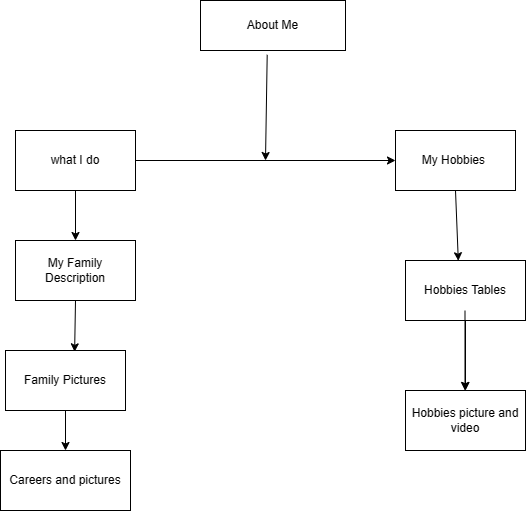

# Milestone 2

## Requirements

- Update the website from Milestone 1 with the following:
     - Add two additional pages

- Development Requirements:
     - HyperText Markup Language (HTML) table element
     - HTML with anchor elements, supporting multi-page navigation
     - HTML media elements supporting audio and video playback
     - HTML lists
      
## Example

### Milestone 2

#### Overview Section

- This is Milestone 2 which documents the requirements, development process, screenshots and recording for this week
- Milestone 2 ...

#### References

- This is the Sitemap which shows ...
     - Provide Link to Sitemap
     

- This is the Wireframes which shows ...
     - Provide Link to Wireframes

- This is the About Me Page ...
     - Provide Image to About Me Page
     
- This is new Page 1 ...
     - Provide Link to Page 1
     
- This is new Page 2 ...
     - Provide Link to Page 2

- This is the Recording ...
     - Provide Link to Recording

#### Conclusion

In Conclusion ...

